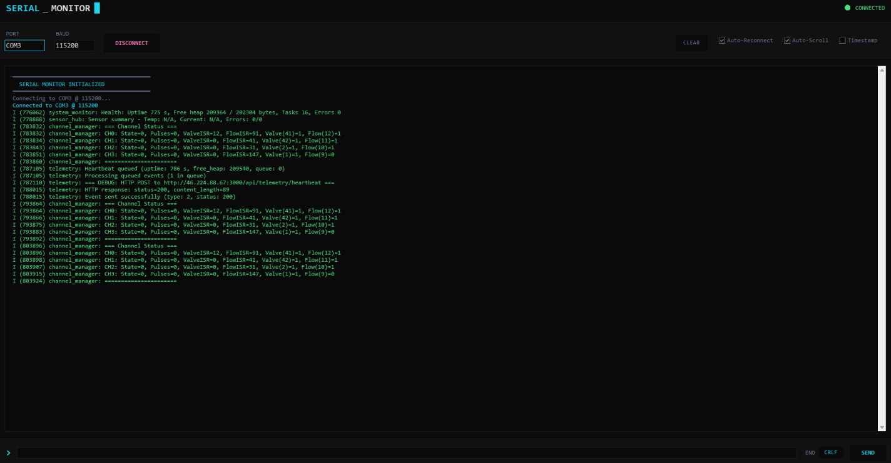

# Serial Monitor

A lightweight serial terminal with auto-reconnect. Built because PuTTY keeps dying.



## Features

- **Auto-connect on startup** to COM3 @ 115200
- **Auto-reconnect** when device disconnects
- Dark terminal-style UI
- Configurable port and baud rate
- Line ending options (None, LF, CR, CRLF)
- Optional timestamps
- Auto-scroll toggle

## Usage

1. Install Python 3.x
2. Run `install.bat` (installs pyserial)
3. Run `SerialMonitor.bat`

Or manually:

```bash
pip install pyserial
pythonw serial_monitor.pyw
```

## Change defaults

Edit `serial_monitor.pyw`:

```python
self.default_port = "COM3"
self.default_baud = 115200
```

## Color coding

- **Green** - Received data (RX)
- **Violet** - Sent commands (TX)
- **Pink** - Errors
- **Yellow** - Warnings
- **Cyan** - System messages
